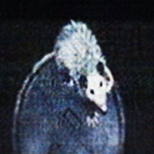

### CROSS-AXIAL LATENT MASKING VISION TRANSFORMER + DISTRIBUTED TRAINING ENVIRONMENT

A novel method for Grid-Wise & Latent Attention in a Vision Tranformer. There are three sub-directories of note inside in this repository:

- CALM-ViT: This is the Axial Vision Transformer used as the experimental implementation including tools for the distributed training enviroment. As of now, this component is quite user unfriendly so just the bare minimum architectural tools and single implementation is provided.

- Deployments: Files to deploy an instance of a 'SparkTorchKafka' container for facilitating distributed training. Also included are files for downloading ImageNet-1k to a PVC, and a one-pod development environment for modeling.

- Docker-Build: Files for creating your own SparkTorchKafka container. This is an Ubuntu-22.04 based image featuring support for Apache Hadoop, Spark, Kafka, PyTorch, and Kafka. I only utilized Spark in our image however provided these modules as optional tools for handling big data. You are free to use the version provided in our container registry if this current arrangement suits your needs.

I will continue to add to this main branch as time continues. For the version of CALM-ViT used in the written thesis, please see the archive branch.

I hope you enjoy CALM-ViT!